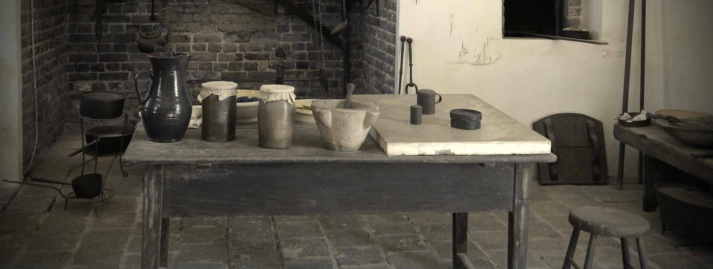

# tableworld

A little [MUD](https://en.wikipedia.org/wiki/Multi-user_dungeon)- and
[MUDDL](https://github.com/PDP-10/MUD1)-[inspired](https://if50.substack.com/p/1980-mud)
game.

# building it

Install Java, Leiningen, make.  Then,

    make

# running it

    ./tw

# playing it

    telnet 127.0.0.1 9999

## example

    $ telnet 127.0.0.1 9999
    Trying 127.0.0.1...
    Connected to localhost.
    Escape character is '^]'.
    >>> help
    Available: look help hello time
    >>> reboot
    I don't understand 'reboot'.
    >>> look
    You are in the hearth room.  There is a heavy stone table here near a
    great fireplace lined with glazed red tile.  To the south lies the mud
    room.
    >>> quit
    Connection closed by foreign host.
    $

# license

MIT.

THE SOFTWARE IS PROVIDED "AS IS", WITHOUT WARRANTY OF ANY KIND, EXPRESS OR
IMPLIED, INCLUDING BUT NOT LIMITED TO THE WARRANTIES OF MERCHANTABILITY,
FITNESS FOR A PARTICULAR PURPOSE AND NONINFRINGEMENT. IN NO EVENT SHALL THE
AUTHORS OR COPYRIGHT HOLDERS BE LIABLE FOR ANY CLAIM, DAMAGES OR OTHER
LIABILITY, WHETHER IN AN ACTION OF CONTRACT, TORT OR OTHERWISE, ARISING FROM,
OUT OF OR IN CONNECTION WITH THE SOFTWARE OR THE USE OR OTHER DEALINGS IN THE
SOFTWARE.
