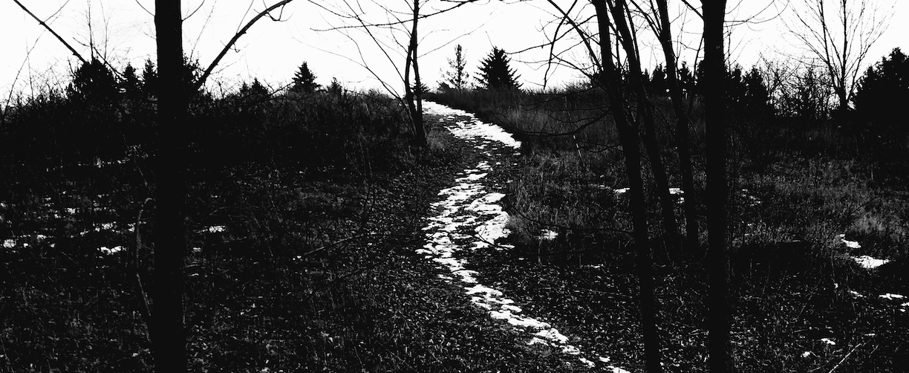

# Big Ball of MUD

A little [MUD](https://en.wikipedia.org/wiki/Multi-user_dungeon)- and
[MUDDL](https://github.com/PDP-10/MUD1)-[inspired](https://if50.substack.com/p/1980-mud)
multiplayer text game.

# goals

1. To play with Clojure / concurrency in the context of a multiplayer game;
2. To explore making text-based games in the MUD heritage;
3. To play with [plain-text representations of game worlds](https://github.com/eigenhombre/ballomud/blob/master/resources/world.yml)
   along the lines of what the original MUD software used.

# features / actions

This is a "[sandbox](https://en.wikipedia.org/wiki/Sandbox_game)" text
game in progress with limited features so far:

- YML-based initial world state
- Move from room to room via (currently) six directions
- Pick up and drop things
- Talk out loud
- Look around or at things
- Look at the entire game state(!)
- NPCs (that don't do anything yet)

<!-- # try it out!

    telnet 206.189.225.15 9999

(May disappear or be restarted without warning....) -->

# building it for yourself

Install [Leiningen](https://leiningen.org/) and `make` using your
package manager.  Then,

    make && ./mud

# alternative: build and run with Docker

    docker build -t ballomud .
    docker run -p 9999:9999 ballomud ./mud

# playing your local copy

    telnet localhost 9999

## example

    $ telnet localhost 9999
    Trying ::1...
    Connected to localhost.

    Escape character is '^]'.
    .....:::::........................................
    .......:^^:....................................... B
    ......::::^::..................................... A
    ......::::^...:................................... L
    .........^^::..................................... L
    .........~:............^!~:....................... O
    ........^P:.......:^75#&@@&BY~:................... M
    ........?57...:~?G&@@@@@@@@@@@&B57^:.............. U
    ........~7!!YB&@@@@@@@&~~~7&@@@@@@@#P?~:.......... D
    ......^?G&@@@@@@@@@@@@B...^G@@@@@@@@@@@&GJ~:......
    .....^P@@@@@@@@@@@@@@@B!7?PG&@@@@@@@&&&@@@G!......
    .:~^^~J@@@B&@@@@@@@@@&@@@@@&@@@@@@@@@&GG&@G.......
    :~!~~75#&#5&@&@@@@@@@@@@@@@&&#@@@&&@@@&&@@&^......
    :^^^^?5@@#5&@#&&&#&&&&&&&&@@@@@#&&&&&BPG#&@~.:::.:
    !!^!~JP&&#P&&#&&&####&###&@@@@@#BBPBB&5!YP#?~!7~^~
    &#B##GG&@&#&&&&####&#&#BB@@@@@@###PBB#B~!7?55557Y5
    @@@&&&BG&&GPPBBBGGPGGPPYY@@@@@@GG#GB###PPPYYGG5?GG
    BGGB&@BB#BJ7??JJY????7~!J&&&&&&5!?Y5B##&&@&&&&@&@@
    &#&@@@&J~^~~!~~~~~~!~~^~~!!~~~~~~~?5BBB&##&#GG#&&&
    @@@@@@@B7^^!!~~^^^^^^^^^^^^^^^^^^^~?J?YBGGP5P&@&&#
    @@@@@@@&YYJY~^^~^~~~~^^^^^:^^^^^^^~~~!??JJ?Y&@&&&&
               https://github.com/eigenhombre/ballomud

      Welcome to the world.

    Are you a bot?  Type 'n' or 'no' if not... no
    What is your name? Margoloth
    Welcome to Ballomud, Margoloth.
      You are in the hearth room.  There is a heavy
      stone table here near a great fireplace lined
      with glazed red tile.  To the south lies the mud
      room.  There is a ladder leading up to an attic.

      Also here: John.
    >>> say Hello, everyone.

      Otter says: 'Hello, everyone.'.
    >>>
    >>> s
      You are in the mud room.  Through the outside
      door to the south you see a great wood.  The
      doorway on the north side opens to the hearth.
    >>> south
      You are in the woods.  Trunks and heavy
      overgrowth obscure your view in all directions.
      Just to the north is a small hut, with door
      ajar.
    >>> south
      You're in the deep forest.  Brush and vines grow
      and dangle all about you.  The forest is
      somewhat less dense to the north.
    >>> north
      The great forest.
    >>>
      You hear a soft breeze blowing.
    >>> ^D
    Connection closed by foreign host.
    $

# license

MIT.

THE SOFTWARE IS PROVIDED "AS IS", WITHOUT WARRANTY OF ANY KIND, EXPRESS OR
IMPLIED, INCLUDING BUT NOT LIMITED TO THE WARRANTIES OF MERCHANTABILITY,
FITNESS FOR A PARTICULAR PURPOSE AND NONINFRINGEMENT. IN NO EVENT SHALL THE
AUTHORS OR COPYRIGHT HOLDERS BE LIABLE FOR ANY CLAIM, DAMAGES OR OTHER
LIABILITY, WHETHER IN AN ACTION OF CONTRACT, TORT OR OTHERWISE, ARISING FROM,
OUT OF OR IN CONNECTION WITH THE SOFTWARE OR THE USE OR OTHER DEALINGS IN THE
SOFTWARE.
